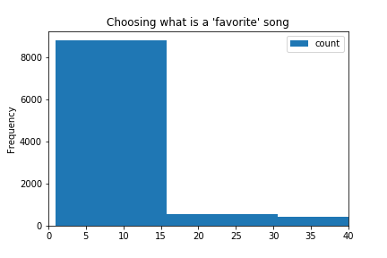

## Building a Spotify Recommender based on Listening History and Song Features
You can find the project's notebook [here](https://nbviewer.jupyter.org/github/isacmlee/song-recommender/blob/master/song-recommender.ipynb).
### Introduction
Based on my Spotify Wrapped for 2019, I accumulated 120,000+ minutes of listening which translates to over 2000 hours, which also translates to a whooping 83.3 days. So I do consider myself a huge music enthusiast and enjoy exploring all the different genres music has to offer. Because of my extensive listening history, I realized I had a lot of data to work with to **create a classifier that will state whether or not I would like to listen to a song or not.**

### About the Data 
We used two datasets in this project: "StreamingHistory.csv" (my Spotify listening history) and "SpotifyFeatures.csv" (dataset with song features). StreamingHistory.csv was obtained through Spotify with a json drop and SpotifyFeatures.csv was downloaded from kaggle. (https://tinyurl.com/y7mpts3e)

StreamingHistory.csv has 66,203 rows and 4 columns (Artist, Date, msPlayed, trackName). SpotifyFeatures.csv contains 223,044 rows and 17 columns. Of these 17 columns, 14 are related to a song's feautures such as popularity, mode, key, and etc. (Read more about the features here: https://developer.spotify.com/documentation/web-api/reference/tracks/get-audio-features/) Moreover, each row represents an individual song. 

### Goal
In this project, I will build a song recommender based on my personal Spotify listening history and a Spotify song features dataset. **To accomplish this, I will compare 3 classifier models: Logistic Regression, Decision Trees and Random Forest, and evaluate each model based on the F1 score. In addition, I will be able to discover which song features appeal to my song preferences more.** 

#### Why use F1 score? 
The F1 score enables us to take into account false negatives and false positives when calculating the accuracy of a model. If we use the generic accuracy_score method, false positives would be considered as correct predictions which is something that is inaccurate and would mislead me into thinking my model is more accurate than it is. 
#### What is a "favorite" song?
The variable that I will be predicting will be a binary feature with 0 representing "not a favorite" and 1 representing a favorite. I will create this binary feature through my personal listening history and label songs with more than 15 listens as a favorite and those with less as "not a favorite". Why 15? When I plotted the song counts on a histogram, there was a drop in song frequencies around 15. I concluded that this would be a good cut off as songs past the cut off were clearly less in number than those before. There most be something about those songs that create this cutoff. As a result, I would be able to hone in on the features that makes a song a favorite more. 

### Process
* Data Cleaning / Exploration 
* Balancing Classes with Oversampling (SMOTE) and Feature Selection
* Model Selection with Cross-validation and Hyperparameter Optimization
* Predicting Songs and Saving Dataset for Personal Use

### Project Value and Actionable Next Steps
This project will enable me to obtain a mass recommendation of songs at once instead of having to go through options such as Discover Weekly (limited to 30 songs), look through different playlists, or opt for a playlist radio. Moreover, with the recommendations generated from this project, I can automate playlist creations by converting the .csv recommendations file into a Spotify playlist, making it convenient for me to access new music instead of adding it manually song by song. Link to that script can be found here: https://github.com/isacmlee/csv-to-playlist.

### Conclusion / Results
Through this project, I was able to fit a Random Forest Tree Classifier with a F1 score of around 99%, confirmed through cross-validation as well as unseen test data. The Logistic Regression model had the lowest F1 score of 79% while the Decision Tree was close to the Random Forest Tree at 97%. 

I also discovered that the song features that had the most association with a favorite song of mine were popularity (+ association), danceability (+ association), and instrumentalness (- association). This finding indicates that my music taste is generally mainstream with good characteristics of a dance song but also with more focus on words. All these features appear to represent the Pop genre, which may indicate that is may favorite genre.

With these features and a hyperparameterized Decision Tree model, I was able to recommend songs that I would favorite and create a playlist with these songs. 
